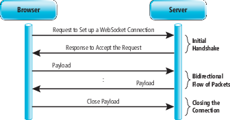

# websocket協定知識 (預計 7/11 完成)

## https://zh.wikipedia.org/wiki/WebSocket
 Websocket與HTTP和HTTPS使用相同的TCP埠，可以繞過大多數防火牆的限制。預設情況下，Websocket協定使用80埠；執行在TLS之上時，預設使用443埠。

 較少的控制開銷。在連接建立後，伺服器和客戶端之間交換資料時，用於協定控制的封包頭部相對較小。在不包含擴充的情況下，對於伺服器到客戶端的內容，此頭部大小只有2至10位元組（和封包長度有關）；對於客戶端到伺服器的內容，此頭部還需要加上額外的4位元組的遮罩。相對於HTTP請求每次都要攜帶完整的頭部，此項開銷顯著減少了。

 保持連接狀態。與HTTP不同的是，Websocket需要先建立連接，這就使得其成為一種有狀態的協定，之後通訊時可以省略部分狀態資訊。而HTTP請求可能需要在每個請求都攜帶狀態資訊（如身分認證等）。

 更好的二進位支援。Websocket定義了二進位影格，相對HTTP，可以更輕鬆地處理二進位內容。

 其他一些定義在HTTP協定中的欄位，如Cookie等，也可以在Websocket中使用。

 客戶端請求：
 GET /chat HTTP/1.1
 Host: server.example.com
 Upgrade: websocket
 Connection: Upgrade
 Sec-WebSocket-Key: dGhlIHNhbXBsZSBub25jZQ==
 Origin: http://example.com
 Sec-WebSocket-Protocol: chat, superchat
 Sec-WebSocket-Version: 13

 伺服器回應：
 HTTP/1.1 101 Switching Protocols
 Upgrade: websocket
 Connection: Upgrade
 Sec-WebSocket-Accept: s3pPLMBiTxaQ9kYGzzhZRbK+xOo=
 Sec-WebSocket-Protocol: chat

成功的狀態碼始終是 101
 Connection必須設定Upgrade，表示客戶端希望連接升級。
 Upgrade欄位必須設定Websocket，表示希望升級到Websocket協定。
 Sec-WebSocket-Key是隨機的字串，伺服器端會用這些資料來構造出一個SHA-1的資訊摘要。把「Sec-WebSocket-Key」加上一個特殊字串「258EAFA5-E914-47DA-95CA-C5AB0DC85B11」，然後計算SHA-1摘要，之後進行Base64編碼，將結果做為「Sec-WebSocket-Accept」頭的值，返回給客戶端。如此操作，可以儘量避免普通HTTP請求被誤認為Websocket協定。
 Sec-WebSocket-Version 表示支援的Websocket版本。RFC6455要求使用的版本是13，之前草案的版本均應當棄用。
 Origin欄位是可選的，通常用來表示在瀏覽器中發起此Websocket連接所在的頁面，類似於Referer。但是，與Referer不同的是，Origin只包含了協定和主機名稱。
 其他一些定義在HTTP協定中的欄位，如Cookie等，也可以在Websocket中使用。

## https://blog.gtwang.org/web-development/websocket-protocol/

當連線用的 socket 建立之後，WebSocket 的 data frames 就可以在瀏覽器與伺服器之間以全雙工的模式進行雙向的傳輸，不管是文字或是二進位的資料都沒問題。

WebSocket 的在將資料打包成 data frame 時，在最好的狀況下只會多出 2 個位元組（bytes）。如果是文字的資料，每一個 frame 會以一個 0x00 這個位元組開頭，最後以 0xFF 這個位元組結束，中間的部分就是 UTF-8 的文字資料，若是二進位的資料，就會以 length prefix 來判斷。不管如何其資料量都會比傳統的 HTTP 協定小很多。

網路頻寬（bandwidth）的比較，WebSocket 的架構所使用的網路頻寬比傳統的 Polling 小非常多。

網路延遲（latency）的比較，由於 WebSocket 在通訊協定上的改進，所以在網路延遲也會比傳統 Polling 所使用的 HTTP 小很多。

## https://www.cnblogs.com/chyingp/p/websocket-deep-in.html

重点请求首部意义如下：

Connection: Upgrade：表示要升级协议
Upgrade: websocket：表示要升级到websocket协议。
Sec-WebSocket-Version: 13：表示websocket的版本。如果服务端不支持该版本，需要返回一个Sec-WebSocket-Versionheader，里面包含服务端支持的版本号。
Sec-WebSocket-Key：与后面服务端响应首部的Sec-WebSocket-Accept是配套的，提供基本的防护，比如恶意的连接，或者无意的连接。

由于是标准的HTTP请求，类似Host、Origin、Cookie等请求首部会照常发送。在握手阶段，可以通过相关请求首部进行 安全限制、权限校验等。

WebSocket客户端、服务端通信的最小单位是帧（frame），由1个或多个帧组成一条完整的消息（message）。

发送端：将消息切割成多个帧，并发送给服务端；
接收端：接收消息帧，并将关联的帧重新组装成完整的消息；

## https://docs.microsoft.com/zh-tw/archive/msdn-magazine/2012/may/cutting-edge-understanding-the-power-of-websockets

# 第三方 websocket使用 (預計 7/12 完成)
https://github.com/gorilla/websocket
https://github.com/olahol/melody
https://github.com/labstack/echo

# 設計一個 websocke server 基於 gorilla (預計 7/12 完成)
- 可以多條 websocket連線
- 驗證客戶端是否合法, 
- 客戶端心跳檢查
- 提供聊天功能 api, 
    1.能廣播訊息給其他用戶
    2.用戶發送自己名子給 server後, server回應 hello
        ex: request: yuan, reponse: hello yuan
> 備註: 包含畫出架構圖